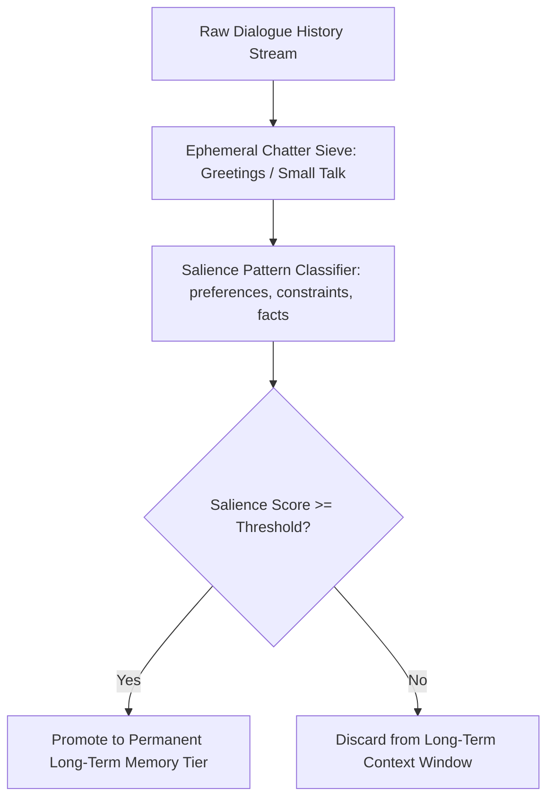

# GenPark AI Agent Skill - Hierarchical Memory Consolidation Compressor

Distills multi-turn conversational dialogue into dense, high-salience persistent semantic memory blocks.

Verified by [GenPark AI](https://genpark.ai) and compatible with [Model Context Protocol (MCP)](https://genpark.ai/mcp).

## Architecture Diagram

## Features
- **Token Pruning**: Prevents context window bloat by dropping pleasantries and transient queries.
- **Zero External Dependencies**: Pure Python 3.9+ standard library.
